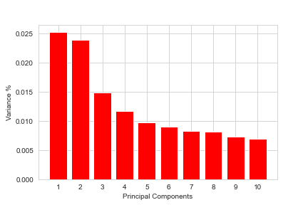
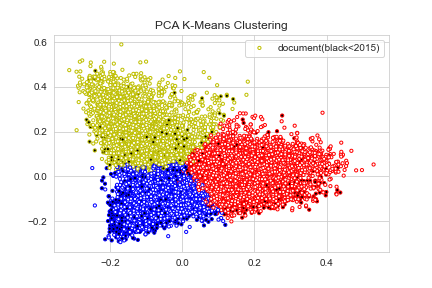
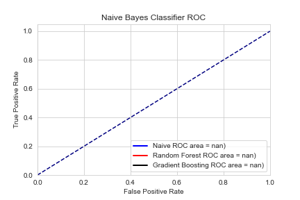

# Predicting Author Count

Does the writing quality, length, or style in groups of researchers differ from how individual researchers write? 
That was the question I asked myself moving into scraping pdf files from [arxiv.org](arxiv.org). Armed with 41 thousand links and a VPN, my computer made calls to arxiv.org in increments of 2 hours (in which I switched IPs) for three days. I proceeded to turn the PDF files into text with ~50% success rate leaving me with 14,066 after cleaning which consisted of cutting off bottom acknowledgements, removing escape words, and utilizing TFIDFVectorizer. 
Through my findings I was not able to reject the null hypothesis. 
My models attempted to determine if one person wrote the paper or more.
The baseline model I created chose the most prevalent class of over one researcher every time.
Through gradient boosting, naive bayes, random forest modeling, model manipulation(max_features etc.), and oversampling my models were unable to consistently outperform the baseline model. 

Quality of research writing is consistent and through not disproving my null hypothesis I have gained even more respect for paper writing academia, learning they have strong quality control and standards. 

I started PCA to gain intuition into how the words are most correlated to each other. This graph shows that the most information gain was when k-means created 3 clusters. 

In my PCA analysis, words relating to which AI algorithm was being used where prevalent, the following are the top 10 word outliers on the tips of the PCA 'triangle.'

TOP LEFT(yellow):image, images, cnn, segmentation, object, network, detection, layer, convolutional, and layers           
BOTTOM LEFT (blue): algorithm, xi, variables, theorem, let, function, graph, problem, probability, and proof         
BOTTOM RIGHT (red): image, images, cnn, segmentation, object, network, detection, layer, convolutional, and layers         

Did the growth of AI research in acidemia create a noticeable change in the lingo being used from 2015 on? 
Once again utilizing the previous modeling techniques I was only able to outperform the baseline model by .15 accuracy with Naive Bayes.

SOURCES:
Thank you Neel Shah for providing me with 30k pdf links for scraping and Andrew Mouros for a wonderful PCA tutorial.
https://www.kaggle.com/neelshah18/arxivdataset by Neel Shah
https://andrewmourcos.github.io/blog/2019/06/06/PCA.html by Andrew Mouros

Tools: Python, Matplotlib, Pandas, NLTK, VPN(for webscaping), and SKLearn ML

GitHub Project by Lynx Rose
