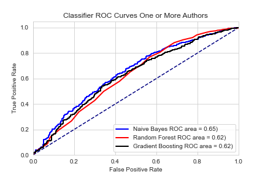

# Predicting Author Count
[Presentation!](https://docs.google.com/presentation/d/13zN646JpEi4FAcMUePQV668tDm_-rnnyJYkGygWoigc/edit?usp=sharing)
[Project One Pager](https://docs.google.com/document/d/1-u0Y-XK09nYjwefSBvc1PbITTa2FsOCkA7o2DyjHZjA/edit?usp=sharing)

Does the writing quality, length, or style in groups of researchers differ from how individual researchers write?
I hope to assist researchers gain more insite into there paper prior to clicking the submit button. Assuming that if more authors write a paper the better written it is, this algorithm will highlight if a paper reads not as polished or as reasearched as it COULD read. 
That was the question I asked myself moving into scraping pdf files from [arxiv.org](arxiv.org). Armed with 41 thousand links and a VPN, my computer made calls to arxiv.org in increments of 2 hours (in which I switched IPs) for three days. I proceeded to turn the PDF files into text with ~50% success rate leaving me with 14,066 after cleaning which consisted of cutting off bottom acknowledgements, removing escape words, and utilizing TFIDFVectorizer. 
My models attempted to determine if one person wrote the paper or more.

The baseline model I created chose the most prevalent class of over one researcher every time.
Through naive bayes with 2000 max_features and oversampling was I able to create a model that preformed the best.

I started PCA to gain intuition into how the words are most correlated to each other. This graph shows that the most information gain was when k-means created 3 clusters. 

In my PCA analysis, words relating to specific academia was being in more prevalence, the following are the top 10 word outliers on the tips of the PCA 'triangle.'

TOP LEFT(yellow: NLP):word, words, sentence, language, et, al, corpus, embeddings, sentences, and variables        
BOTTOM LEFT (blue: Structures and Algorithms): algorithm, xi, variables, theorem, let, function, graph, problem, probability, and proof         
BOTTOM RIGHT (red: Image Recognition): image, images, cnn, segmentation, object, network, detection, layer, convolutional, and layers         

The following are papers most confidently predicted by my algorithm in their relative classes: [1](https://www.aclweb.org/anthology/D15-1205.pdf) and [More than 1](http://proceedings.mlr.press/v37/yogatama15.pdf)

The model I have created and the PCA clustering analysis shows general trends of individual researchers around the borders of specific fields rather working with multiple fields in tandem. This would make sense generally, as most individuals are not experts in multiple fields of research. Through text analysis I have determined that there are very little indications of multiple researchers writing text differently than individuals. 

SOURCES:
Thank you Neel Shah for providing me with 30k pdf links for scraping and Andrew Mouros for a wonderful PCA tutorial.
https://www.kaggle.com/neelshah18/arxivdataset by Neel Shah
https://andrewmourcos.github.io/blog/2019/06/06/PCA.html by Andrew Mouros

Tools: Python, Matplotlib, Pandas, NLTK, VPN(for webscaping), and SKLearn ML

GitHub Project by Lynx Rose
